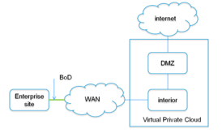

= Abstract
Network management is challenging. To operate, maintain, and secure the network communication,
the network operators must grapple with low-level vendor-specific configuration to implement
complex high-level network policies. The software defined networking (SDN) paradigm has been established
to simplify the network management. SDN separates the data plane and the control plane, making network
switches in the data plane simple packet forwarding devices and leaving a logically centralized
software program to control the behavior of the entire network. Opendaylight is a SDN controller that used
to control the entire network behavior. By using Opendaylight network operators could easily define and apply
a network policy for their enterprise communications and change it on demand. We will show in the following usecase how
Opendaylight helps to apply constrains on an enterprise network and change its communication bandwidth on demand.

== How to specify the Bandwidth On Demand (BOD) for Enterprise Network?
**Description:** +
In this tutorial we will use Opendaylight Nemo project to provide a secure virtual private cloud service to
an enterprise site. The scenario is a network operator wants to allocate two zones;
Data Management Zone (DMZ) and Interior Zone. The DMZ zone provides the video/email access from internet
and Interior zone provides compute and storage resources. A constrain exist in the network topology which
allows only one zone can communicate with other zones that are directly connected to it.
Also the network operator provides Bandwidth On Demand (BOD) services for the connection between
the enterprise site and the interior zone. The following diagram shows high level design for the network topology.

*Precondition:* +

- Inocybe's Open Networking Platform registration: +
        It is assumed that you have registered at https://platform.inocybe.com

- VirtualBox: +
        Download VirtualBox and install it from https://www.virtualbox.org/wiki/Downloads

-  Vagrant: +
        Download Vagrant and install it from https://www.vagrantup.com/downloads.html

- The tutorial's material from GitHub: +
        You can download the tutorial's material from https://github.com/serngawy/Nemo-VM

=== Applying BOD Service
**Main Success Scenario:** +
In this tutorial we will create a network topology consisting of 2 switches, 2 routers, 4 hosts. The network topology
will be simulated inside the Nemo-VM. Opendaylight will be running in the tutorial host machine
and has the odl-nemo features installed.

As we mentioned at the beginning the network operator
wants to provide BoD service for the Enterprise site. We will establish the network bandwidth with 1024 GHz
between the enterprise site and the virtual private cloud network (supposed to be in the morning when the
employees are connected to the network) then we will downgrade the bandwidth to be 512 GHz (supposed to be over night)
By the end of the tutorial, you will be able to see the enterprise network topology at Opendaylight Nemo dlux webpage and will be able to see the applied policy
on the network.

=== How to do it...

* First step is to spawn the VMs that we will be use in this tutorial. Open a new console in your host machine and go to the tutorial material directory

    $ cd Nemo-VM
    $ vagrant up

This step will take bit of time as it creates the VM and configure its components.

* While vagrant creates our tutorial VM, we will start the Inocybe's distribution.
Go to the https://platform.inocybe.com and download Inocybe Nemo-based distribution that we will use to manage
our enterprise network. After you download the distribution go to the distribution directory extract it and run the following commands.

    $ cd Inocybe-Nemo-based-distribution/
    $ ./bin/karaf

* At Opendaylight Karaf console, you will find all the required Nemo features (odl-nemo-openflow-renderer odl-nemo-engine-ui)
has been installed by default. Use the following command to check the installed features.

    opendaylight-user@root>feature:list -i | grep nemo

* As our tutorial VM has been created, we will create the Enterprise network topology.
Using the same console, run the following command to check if everything went well.

    $ vagrant status
    Current machine states:
    Nemo-VM                 running (virtualbox)
    Login to the Nemo VM using the following command.
    $ vagrant ssh

* At the tutorial material directory, the network-up.sh script has detailed
explanation and the commands to create the virtual network topology. Let's create
 the network at the Nemo VM console.

    vagrant@Nemo-vm:~$ sudo ./network-up.sh {ODL_HOST_IP_ADDRESS}

    You can check the network hosts have been created fine using the following command
    vagrant@Nemo-vm:~$ ip netns show
    inet
    enter
    server2
    vm2
    vm1
    server1

    Check the network topology using the below commands, you should see the sw1, sw2, sw3 and sw4 has been linked to eth1.
    vagrant@Nemo-vm:~$ ifconfig
    Check the links between the network host using the below command.
    vagrant@Nemo-vm:~$ ip link list

* Now Opendaylight needs to have the pre-defined Intent expressions that will be applied on
 the Enterprise network topology we create. At the tutorial material folder, the nemo-odl.py file has a
 the REST API calls that send basic Intent expressions information to Opendaylight. Run the script
 using the following command.

    $ python nemo-odl.py

* Then we will establish the connections between the network hosts using the bod-512.py (suppose to be at night)

    $ python bod-512.py

* Open you browser and go to http://{ODL_HOST_IP_ADDRESS}:8181/index.html#/nemo . Check the physical network tab, you will
 see the network topology and its information.

* Switch to the Nemo intent tab, you will see the network policy graph mapping the network topology.
 By scrolling down in the Nemo language tab you will see the created bandwidth between the TMZ and the
 Enterprise site is 512 GHz

    CREATE Connection c2 Type p2p Endnodes interior,dmz;
    CREATE Connection c1 Type p2p Endnodes enterprise,interior Property bandwidth:"512";

* Now we will execute the bod-1024.py script to update the connection bandwidth between the TMZ and Enterprise
network to 1024 GHz.

    $ python bod-1024.py

    back to the Opendaylight's Nemo web page you should see the bandwidth updated to 1024 GHz.
    CREATE Connection c2 Type p2p Endnodes interior,dmz;
    CREATE Connection c1 Type p2p Endnodes enterprise,interior Property bandwidth:"1024";

=== Conclusion:
Opendaylight allows the network operators easily and seamlessly manage the network connections and bandwidth
with less effort.