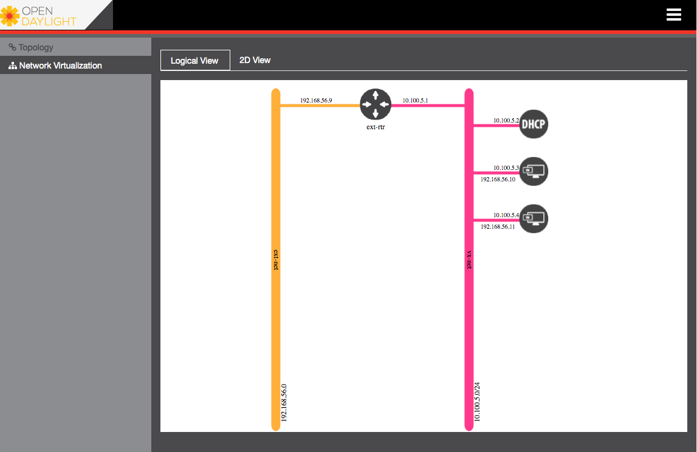
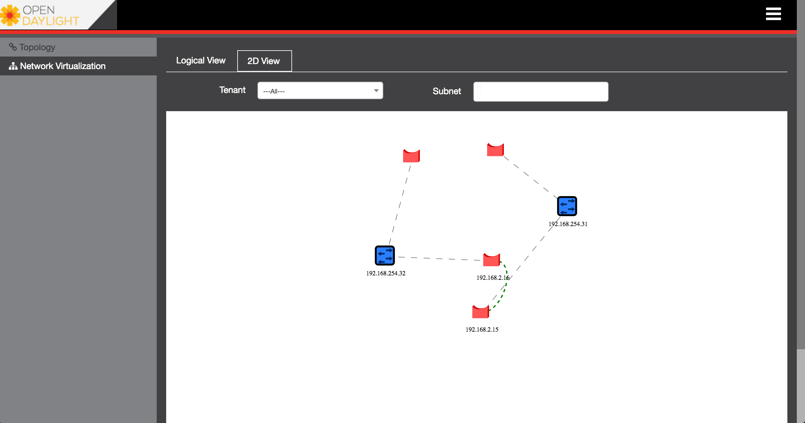
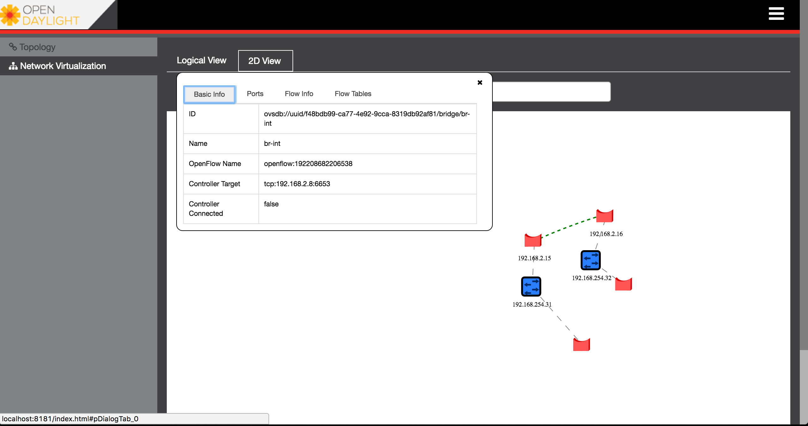
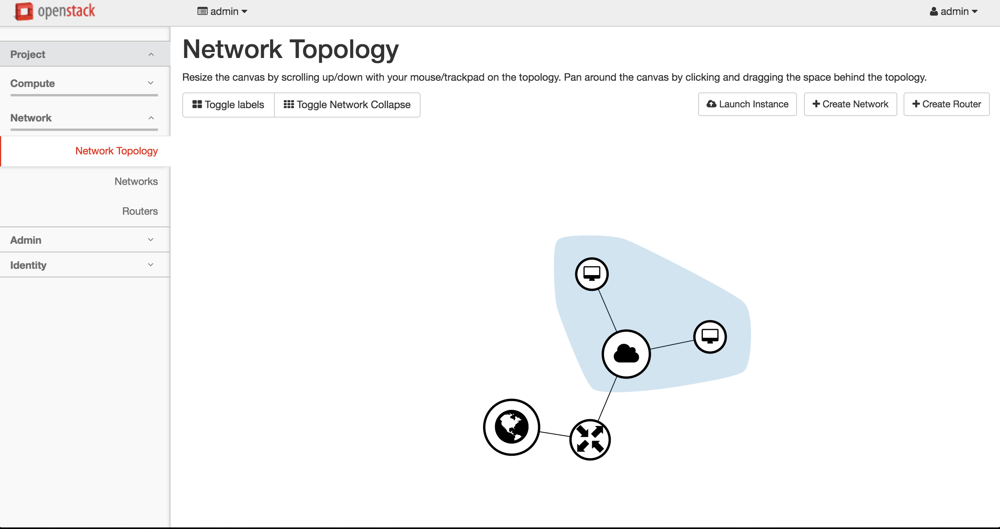
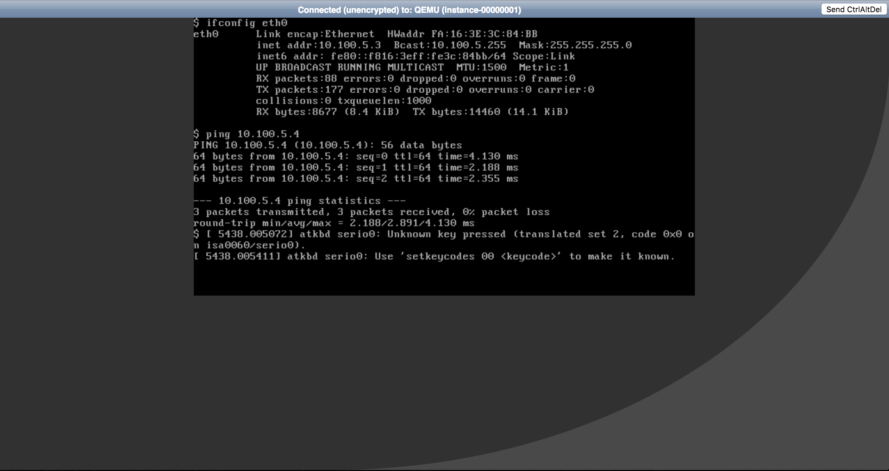

= Abstract
Virtual networking enables virtual computer systems (ex: virtual machines) to be networked together.
Virtual computer systems connect to each other and to the network using virtual Ethernet ports and virtual
Ethernet switches. Software define network (SDN) paradigm can be used to reduce the complexity and cost of managing
the virtual networking components.
Opendaylight as SDN controller provides integration with different cloud platforms solutions such as
Openstack to simplify the virtual network creation and management. In this use-case we will show how Opendaylight can help the virtual network operator to easily manage the
underlying virtual network elements such as bridges and virtual ports.

== How to create network elements using OpenStack's Neutron?
**Description:** +
In this tutorial we will use Openstack and Opendaylight to create a Virtual Extensible LAN (VxLAN) network between hosts (VMs).
We will show how is the integration between Openstack and Opendaylight allows seamless communication between the VMs at a VxLAN network.

**Primary Actor:** +
    In this tutorial we will use Openstack to create a VxLAN network containing subnet, router, floating IPs and two VMs.
    Also we will learn how Opendaylight can be used to show the underlying network elements.

*Precondition:* +

- Inocybe's Open Networking Platform registration: +
        It is assumed that you have registered at https://platform.inocybe.com

- VirtualBox: +
    You should have VirtualBox installed in your tutorial environment. +

- Ovsdbtutorial_mitaka_boron_external.ova: +
     You should download the prepared virtual machines OVA image file from
     https://wiki.opendaylight.org/images/HostedFiles/ovsdbtutorial15_2_liberty_be_external.ova +

**Main Success Scenario:** +
In this tutorial we will create Openstack control node and at least one Openstack compute node both of them running along with Opendaylight.
At the Openstack environment, we will create 2 sub-networks, 1 router and 2 VMs. At the Opendaylight distribution we will install odl-ovsdb-openstack and odl-ovsdb-ui features

=== How to do it...
The OVA image that required by the tutorial provides three VMs: +
    1- OpenStack control and compute – devstack – OvS – CentOS7 +
    2- OpenStack compute – devstack – OvS – CentOS7 +
    3- Router for external access – CentOS6.5 +
The first and second VMs have a devstack included and we will modify the local.conf (devstack configuration) to match
 our tutorial environment.

* First open the VirtualBox application and use import to load the OVA image file. VirtualBox will take around 5 min to load the three VMs. +

* While VirtualBox load the VMs, we will start the Inocybe's distribution.
Go to the https://platform.inocybe.com and download Inocybe Edge-based-virtual-network distribution that we will use to manage
our virtual network. After you download the distribution go to the distribution directory extract it and run the following commands.

    $ cd Inocybe-Edge-based-virtual-network-distribution/
    $ vi etc/custom.properties
    Uncomment line 86 in order to have this enabled:
    ovsdb.l3.fwd.enabled=yes
    $ ./bin/karaf

* At Opendaylight Karaf console, you will find all the required OVS and Openstack features (odl-ovsdb-openstack odl-ovsdb-ui)
has been installed by default. Use the following command to check the installed features.

    opendaylight-user@root>feature:list -i | grep ovsdb

* Back to the Virtual Box, start the odl31-control VM, odl32-compute VM and router-node VM.

* On the 2 VMs odl31-control and odl32-compute, edit the local.conf to add the IP-Address of the host running OpenDaylight.
Use odl as username and password to login to the VMs.

    $ vi /opt/devstack/local.conf
    Change the value of ODL_MGR_IP with the IP address of the host running ODL.

* Now we will start stacking the Openstack environment. In both VMs run the following.

    $ ./opt/devstack/stack.sh

    - Notes: It might happen while you are waiting for the stacking to finish, you will see in the console message waiting for bridge br-ex
     to be available then the stacking fail. If that happen do the following hack to be able to proceed with our tutorial.
    Open another console to the odl31-control VM and run the following commands. +
    $ ./opt/devstack/unstack.sh +
    $ ./opt/devstack/stack.sh +
    Keep watching the console when the console stops at the following message "waiting for bridge br-ex to be available"
    go to the first odl31-control VM console and run the following command: +
    $ sudo ovs-vsctl add-br br-ex +
    this will let the stacking operation continue normally to the end.

* After the stacking is successfully finished in both devstack VMs, we will create the VxLAN network and spawn 2 VMs. At the
odl31-control VM run the following command to get the Openstack's user admin privilege.

    $ source /opt/devstack/openrc admin admin

* We will create the nano flavor for the VMs that we will use as network hosts in our tutorial and establish a ssh keypair to be able
to access it later.

    $ nova flavor-create m1.nano auto 64 0 1
    $ nova keypair-add --pub-key ~/.ssh/id_rsa.pub admin_key

* Now we will establish the VxLAN that will be used in the tutorial. Basically, we will create 2 subnet ext-subnet and vx-subnet, then attach both of them to a router ext-rtr.

    $ neutron net-create ext-net --router:external --provider:physical_network public --provider:network_type flat
    $ neutron subnet-create --name ext-subnet --allocation-pool start=192.168.56.9,end=192.168.56.14 --disable-dhcp --gateway 192.168.56.1 ext-net 192.168.56.0/24
    $ neutron router-create ext-rtr
    $ neutron router-gateway-set ext-rtr ext-net
    $ neutron net-create vx-net --provider:network_type vxlan --provider:segmentation_id 1500
    $ neutron subnet-create vx-net 10.100.5.0/24 --name vx-subnet --dns-nameserver 8.8.8.8
    $ neutron router-interface-add ext-rtr vx-subnet

* Now we will create 2 VMs (vmvx1 and vmvx2) using the nano flavor we created before.

    $ nova boot --poll --flavor m1.nano --image $(nova image-list | grep 'uec\s' | awk '{print $2}' | tail -1) --nic net-id=$(neutron net-list | grep -w vx-net | awk '{print $2}') vmvx1 --availability_zone=nova:odl31 --key_name admin_key
    $ nova boot --poll --flavor m1.nano --image $(nova image-list | grep 'uec\s' | awk '{print $2}' | tail -1) --nic net-id=$(neutron net-list | grep -w vx-net | awk '{print $2}') vmvx2 --availability_zone=nova:odl32 --key_name admin_key

* Then we will create a floating IP for both VMs so they can be accessible through the external network.

    for vm in vmvx1 vmvx2; do
        vm_id=$(nova list | grep $vm | awk '{print $2}')
        port_id=$(neutron port-list -c id -c fixed_ips -- --device_id $vm_id | grep subnet_id | awk '{print $2}')
        neutron floatingip-create --port_id $port_id ext-net
    done;

* Note: all the previous commands we used to create the VxLAN network and the VMs are exist in one script exist under /opt/tools/os_ doitall.sh
directory, you can use this script to execute all previous commands.

    $ ./opt/tools/os_doitall.sh

=== Check how Opendaylight and Openstack work together ...

Open a browser and go to the Opendaylight dlux web page using the following url http://${ODL_HOST_IP_ADDRESS}:8181/index.html#/ovsdb/index.
Login to the dlux using the admin user (username=admin password=admin) then click on network virtualization
in the left tab. You should see the following

when you switch to 2D view, you will have a better scene for the network underlying elements and bridges such as the br-int and br-ex.
By clicking on the br-int and br-ex you will be able to see the bridge info such as controller IP, flow rules, etc.

Now to check the Openstack side, open a new tab in your browser and go to the following url http://192.168.50.31/dashboard/project/network_topology/
Use the admin user (username=admin password=admin) to be able to login to Openstack horizon web page. you should see the following

To test the created network, you can get access to one of the VMs (vmvx1 or vmvx2) console.
Login to the VM using the provided user information that will appear when you open the console tab and ping the other VM. You should see the following

=== Conclusion ...
Opendaylight and Openstack integration provides a seamless connectivity between the virtual hosts at virtual networks environment
and it helps the network operator to easily manage the underlying virtual network elements.
