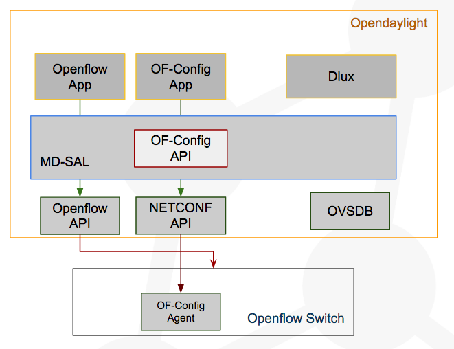
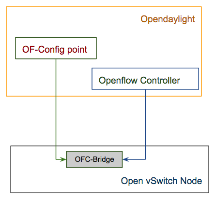

= Abstract

Openflow protocol made extraordinary shift on the network's switches design and implementation.
Most switch vendors today support pure Openflow switch or hybrid switches. The OpenFlow Management
and Configuration Protocol (OF-Config) is a special set of rules that defines a mechanism for OpenFlow controllers to access and modify configuration data on an
OpenFlow switch. Opendaylight SDN controller provides southbound OF-Config implementation that allows
Opendaylight to communicate with OF-Config capable switches. In the following usecase we wil show how Opendaylight
can communicate with the OF-Config capable switches and push the desired configuration to the switch.

== How to use OF-Config protocol to configure an Open vSwitch node in SDN environment
**Description:** +
This tutorial aims to show you how to use Opendaylight's OpenFlow Configuration Protocol (OF-CONFIG) southbound API to configure the OpenFlow-capable switch that has OF-Config capability.
The OF-CONFIG protocol enables remote configuration of the basic artifacts of an OpenFlow Logical Switch which allows an OpenFlow controller
connect to OpenFlow Logical switch via the OpenFlow protocol. OpenFlow switches that have OF-Config capability should have OF-Config Agent that manage the communication with the configuration point which is Opendaylight in our tutorial.
Opendaylight OF-Config protocol southbound API works as a wrapper to the NETCONF protocol southbound API.
However, it is used to map the communication between the OF-Config Agent that run on the OpenFlow-capable switch and NETCONF protocol southbound API.

*Precondition:* +

- Inocybe's Open Networking Platform registration: +
        It is assumed that you have registered at https://platform.inocybe.com

- VirtualBox: +
        Download VirtualBox and install it from https://www.virtualbox.org/wiki/Downloads

-  Vagrant: +
        Download Vagrant and install it from https://www.vagrantup.com/downloads.html

- The tutorial's material from GitHub: +
        You can download the tutorial's material from https://github.com/serngawy/OF-ConfigVM

- REST-API client: +
        We recommend using postman as REST-API client https://www.getpostman.com/

=== Using OF-Config
**Main Success Scenario:** +
In this tutorial we will create a VM acting as Open vSwitch node that has OF-CONFIG capability and we will use the Opendaylight OF-Config southbound API
to communicate with the OF-CONFIG agent and configure the Open vSwitch node.

=== How to do it...

* First step is to spawn the VMs we will be using within this tutorial. Open a new console in you host machine and go to the tutorial material directory

    $ cd OF-ConfigVM
    $ vagrant up

This step will take bit of time as it creates the VM and configure its components.

* While vagrant creates our tutorial VM, we will start the Inocybe's distribution.
Go to the https://platform.inocybe.com and download Inocybe OFConfig-based distribution that we will use to configure
the openflow switch. After you download the distribution go to the distribution directory extract it and run the following commands.

    $ cd Inocybe-OFConfig-based-distribution/
    $ ./bin/karaf

* At Opendaylight Karaf console, you will find all the required of-config feature (odl-of-config-all)
has been installed by default. Use the following command to check the installed features.

    opendaylight-user@root>feature:list -i | grep of-config

* Now as our tutorial VM has been created, we will need to run the OF-CONFIG agent in our Open vSwitch node.
Using the same console, run the following command to check if everything went well.

   $ vagrant status

You should see output like that:

    Current machine states:
    ofcserver                 running (virtualbox)

Login to the ofcserver VM to start the OF-CONFIG agent

    $ vagrant ssh ofcserver

Get the ofcserver VM IP-Address information

    vagrant@ofconfig-vm:~$ ifconfig

Keep the ofcserver VM IP-Address we will use it later. Then start the OF-CONFIG agent using the following command

    vagrant@ofconfig-vm:~$ sudo ofc-server -v 3 -f

* Import the OF-CONFIG json payload collection to Postman. Open postman application and use the import button to navigate to out tutorial material directory
and add the OF-CONFIG.postman_collection.json You will have 3 REST API calls; GET Network, POST Connection Establishment and POST Modify Controller Connection.

Now Open the Connection Establishment payload and in the body tab modify the address tag by the ofcserver VM IP Address

    <address xmlns="urn:opendaylight:params:xml:ns:yang:controller:md:sal:connector:netconf">${OFCSERVER_VM_IP}</address>

Then press send to establish the connection between Opendaylight and Open vSwitch node.

* Now to confirm that the connection has been established successfully use the GET Network payload API.

You should see the network topology as follow:

    {
      "network-topology": {
        "topology": [
          {
            "topology-id": "ofconfig-capable:1",
            "node": [
              {
                "node-id": "ofnetconf",
                "odl-ofconfig-topology:ofconfig-capable-switch-attributes": {
                  "netconf-topology-node-id": "ofnetconf",
                  "capable-switch": {
                    "resources": {
                      "port": [
                        {
                          "name": "ofc-bridge",
                          "requested-number": 666,
                          "configuration": {
                            "no-forward": false,
                            "no-packet-in": false,
                            "admin-state": "down",
                            "no-receive": false
                          }
                        }
                      ]
                    },
                    "logical-switches": {
                      "switch": [
                        {
                          "id": "ofc-bridge",
                          "datapath-id": "00:01:02:03:04:05:06:07",
                          "lost-connection-behavior": "failSecureMode",
                          "resources": {
                            "port": [
                              "ofc-bridge"
                            ]
                          }
                        }
                      ]
                    },
                    "id": "openvswitch"
                  },
                  "ofconfig-version": "odl-ofconfig-types:of-config-type-version-12"
                }
              }
            ]
          },
          {
            "topology-id": "topology-netconf",
              {
                "node-id": "ofnetconf",
                "netconf-node-topology:connection-status": "connected",
                "netconf-node-topology:unavailable-capabilities": {
                  "unavailable-capability": [
                    {
                      "capability": "(urn:ietf:params:xml:ns:yang:ietf-netconf-monitoring?revision=2010-10-04)ietf-netconf-monitoring",
                      "failure-reason": "unable-to-resolve"
                    },
                    {
                      "capability": "(urn:ietf:params:xml:ns:netmod:notification?revision=2008-07-14)nc-notifications",
                      "failure-reason": "unable-to-resolve"
                    },
                    {
                      "capability": "(urn:ietf:params:xml:ns:yang:ietf-netconf-notifications?revision=2012-02-06)ietf-netconf-notifications",
                      "failure-reason": "unable-to-resolve"
                    },
                    {
                      "capability": "(urn:ietf:params:xml:ns:netconf:notification:1.0?revision=2008-07-14)notifications",
                      "failure-reason": "unable-to-resolve"
                    }
                  ]
                },
                "netconf-node-topology:available-capabilities": {
                  "available-capability": [
                    "(urn:cesnet:params:xml:ns:libnetconf:notifications?revision=2016-07-21)libnetconf-notifications",
                    "urn:ietf:params:netconf:base:1.1",
                    "urn:ietf:params:netconf:base:1.0",
                    "urn:ietf:params:netconf:capability:notification:1.0",
                    "(urn:ietf:params:xml:ns:netconf:base:1.0?revision=2011-06-01)ietf-netconf",
                    "(urn:ietf:params:xml:ns:yang:ietf-netconf-with-defaults?revision=2010-06-09)ietf-netconf-with-defaults",
                    "urn:ietf:params:netconf:capability:startup:1.0",
                    "urn:ietf:params:netconf:capability:rollback-on-error:1.0",
                    "(urn:ietf:params:xml:ns:yang:ietf-yang-types?revision=2013-07-15)ietf-yang-types",
                    "urn:ietf:params:netconf:capability:validate:1.1",
                    "(urn:onf:config:yang?revision=2015-02-11)of-config",
                    "urn:ietf:params:netconf:capability:validate:1.0",
                    "(urn:ietf:params:xml:ns:yang:ietf-inet-types?revision=2013-07-15)ietf-inet-types",
                    "urn:ietf:params:netconf:capability:candidate:1.0",
                    "urn:ietf:params:netconf:capability:url:1.0?scheme=scp,file",
                    "urn:ietf:params:netconf:capability:writable-running:1.0",
                    "urn:ietf:params:netconf:capability:interleave:1.0",
                    "(urn:ietf:params:xml:ns:yang:ietf-x509-cert-to-name?revision=2013-03-26)ietf-x509-cert-to-name",
                    "(urn:ietf:params:xml:ns:yang:ietf-netconf-server?revision=2014-01-24)ietf-netconf-server",
                    "urn:ietf:params:netconf:capability:with-defaults:1.0?basic-mode=explicit&also-supported=report-all,report-all-tagged,trim,explicit"
                  ]
                },
                "netconf-node-topology:host": "192.168.1.104",
                "netconf-node-topology:port": 830
              }
            ]
          },
          {
            "topology-id": "ofconfig-logical:1",
            "node": [
              {
                "node-id": "ofnetconf:openvswitch:ofc-bridge",
                "odl-ofconfig-topology:ofconfig-logical-switch-attributes": {
                  "capable-switch-id": "openvswitch",
                  "datapath-id": "00:01:02:03:04:05:06:07",
                  "logical-switch": {
                    "datapath-id": "00:01:02:03:04:05:06:07",
                    "lost-connection-behavior": "failSecureMode",
                    "resources": {
                      "port": [
                        "ofc-bridge"
                      ]
                    },
                    "id": "ofc-bridge"
                  },
                  "ofconfig-version": "odl-ofconfig-types:of-config-type-version-12",
                  "netconf-topology-node-id": "ofnetconf"
                }
              }
            ]
          }
        ]
      }
    }

* Now In the Opendaylight distribution we will install the openflowplugin-flow-services feature in order to be able to connect to the Open vSwitch node

    opendaylight-user@root>feature:install odl-openflowplugin-flow-services

Note: In ideal situation we should use another SDN controller to separate the OpenFlow-capable switch configuration and management.
However in our tutorial we use the same SDN controller for simplicity.

* Back to the Postman application open modify-controller-connection payload and modify the ip-address tag with the host machine IP-Address

    "ip-address": "ODL_HOST_IP_ADDRESS"

Then press the send button in order to configure the ofc-bridge bridge in the Open vSwitch node to be controlled by the Opendaylight distribution.

* Now open a new console and connect to the ofcserver VM as we did  before, then check the Open vSwitch connection.

    $ vagrant ssh ofcserver
    $ sudo ovs-vsctl show

You should see ofc-bridge should be connected to the odl VM Opendaylight distribution

        Bridge ofc-bridge
            Controller "tcp:192.168.1.192:6633"
                is_connected: true
            fail_mode: secure
            Port ofc-bridge
                Interface ofc-bridge
                    type: internal

=== Conclusion:
Opendaylight gives you the ability to manage and configure the Open vSwitch nodes in the SDN environment using the OF-Config protocol.