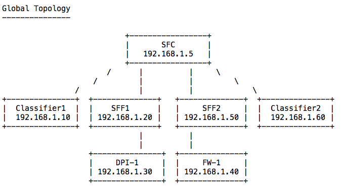
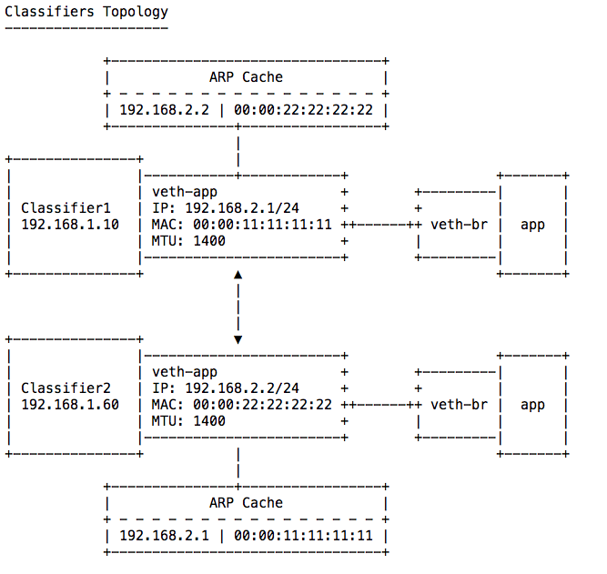

= 'Abstract'
Service Function Chaining is the ability to cause network packet flows to be routed through a network via a path other than the basic destination based forwarding which is typical of IP based networks.
This mechanism can be used to enforce policies, perform security functions and other broad range of features.
SFC often is used in context of Network Function Virtualization (NFV) where Virtual Network Functions (VNFs) replace the traditional physical network devices (e.g. firewalls, load balancers) to offer end-to-end services.
The service function chain project in OpenDaylight provides the network operators with end-user application to define, configure, and instantiate Service Function Chains and thereby "steer" traffic through those service functions.
Operators can easily take benefits of service insertion capability to add or modify new services.

== 'Use-case': How to create an OpenFlow-based Service Function Chain and Rendered Service Path using Opendaylight?
**Description:** +
Service Function Chaining allows a network operator to define an ordered list of a network services (for e.g. firewalls, load balancers, application specific services) which are "stitched" together in the network to render an end-to-end service.

This tutorial describes how to create a rendered service path that uses inserted service function chains with Open vSwitch as a service function forwarder.

**Preconditions:** +

- Inocybe's Open Networking Platform registration:
        It is assumed that you have registered at https://platform.inocybe.com

- VirtualBox:
        Download VirtualBox and install it from https://www.virtualbox.org/wiki/Downloads

- Vagrant:
        Download Vagrant and install it from https://www.vagrantup.com/downloads.html

- REST-API client:
        We recommend using Postman as REST-API client https://www.getpostman.com/

- Host machine requirements:
        Atleast 8GB RAM since we will be running 7 VMs.

**Background:** +

- 'Service Function (SF)':  A function that is responsible for specific treatment of received packets and is realized either as a virtual element or be embedded in a physical device.

- 'Network Service': A composite service offering provided by an operator that is delivered using one or more service functions.

- 'Classifier':  Performs matching of traffic flows against policy for subsequent application of the required set of network service functions.  The policy may be customer/network/service specific.

- 'Service Function Forwarder (SFF)':  Responsible for forwarding traffic to one or more connected service functions as well as handling traffic coming back from the SF.

- 'Service Function Chain (SFC)':  Defines an ordered set of abstract service functions (SFs) and ordering constraints that must be applied to packets and/or frames and/or flows selected as a result of classification.

- 'Service Function Path (SFP)':  Provides a high-level notion of service chain as a sequence of service functions through which a packet using a certain service chain must go in the network.

- 'Rendered Service Path (RSP)':  Sequence of actual visits by a packet to specific SFFs and SFs in the network.

- 'Service Function Chaining Agent (SFC agent)': Runs on SFF and is responsible for receiving ODL REST requests and creating SFs, SFFs and RSPs in the data plane. Allows for almost configure-less deployment.

=== How to do it?

**Getting started:** +
In this recipe we shall create a rendered service path with Open vSwitch as a service function forwarder, using the sfc103 demo provided within their repository: https://github.com/opendaylight/sfc/tree/release/beryllium-sr3/sfc-demo/sfc103

To access the sfc103 demo scripts clone the forked SFC repository as shown below:

    $ git clone https://github.com/rushmep3/sfc.git

SFC Global topology as seen in the diagram will have 7 VMs: 1 running Opendaylight's SFC features, 2 Classifier VMs running OVS instance and HTTP client-server applications, 2 SFF VMs which have OVS as forwarding element, 2 Service Functions VMs running the sfc-agent: one Deep packet Inspection and one Firewall. More details on these can be found in later sections.

**Running sfc103 demo scripts:** +
Before starting the demo scripts use Inocybe platform access the recipe and the distribution for SFC project.
Once the distribution is ready change directory to the sfc folder from the "Getting started" section and download it locally.

    $ cd sfc                      // Change directory to the sfc folder
    $ mkdir inocybe-distro        // Create a new directory for the distro
    $ cd inocybe-distro           // Download the distribution using Inocybe Platform to this folder'
    $ unzip <distro_filename>     // Extract the contents of the distribution files
    $ ls                          // Check the contents of the distribution
      LICENSE  configuration  deploy  idmlight.db.mv.db  journal  lock  system
      bin  data  etc  instances  lib  snapshots  version.properties

The 'sfc' folder will be shared with all the VMs so they have access to the scripts and the Inocybe distribution needed to run the demo.

You can either run the demo.sh script that does everything to setup and run basic test on environment to validate it.

Optionally you can manually configure the setup by referring to demo.sh. Below we shall use the automatic setup and explain the details of what happens in background when the script is run.

Start the demonstration installation which automatically configures the topology and SFC:

    $ cd sfc-demo/sfc103/
    $ ./demo.sh

It takes long time to complete the demo as it includes vagrant box download, SFC download/build and OVS with NSH installation. Depending on your network the setup could take several minutes.

**Verifying the setup for sfc103:** +
The demo.sh script verifies the setup too. However, you may also try to perform a wget from one of the classifier VMs as below:

    $ vagrant ssh classifier1  -c "sudo ip netns exec app wget http://192.168.2.2"
    --2016-09-07 19:20:21--  http://192.168.2.2/
    Connecting to 192.168.2.2:80... connected.
    HTTP request sent, awaiting response... 200 OK
    Length: 1556 (1.5K) [text/html]
    Saving to: ‘index.html’
    100%[=========================================================================================================>] 1,556       --.-K/s   in 0.002s
    2016-09-07 19:20:21 (848 KB/s) - ‘index.html’ saved [1556/1556]
    Connection to 127.0.0.1 closed.

As a result of a successful demo setup completion, the Classifier VMs

=== Behind the scene: What does the demo script run?

==== Create and configure VMs as needed by the global and classifier topology:
We shall look at the VM configuration for each entity in the topology. Refer to the Vagrantfile in the sfc103 directory for more details.
Note that the host's 'sfc' folder is synced with all the VMs.

**'VM1: Opendaylight VM'** +

The associated script for configuring this VM is setup_odl.sh. Snippets of the script are referenced below to add explanation about what they do.

  - Vagrant VM specifications: 4 CPU, 4GB RAM, Private IP of 192.168.1.5

  - Starts the Karaf instance from the SFC recipe distribution.

    30 cd /home/vagrant/sfc/inocybe-distro/bin; ./start clean

  - Automatically installs necessary features for SFC namely: ['odl-sfc-ui odl-sfclisp odl-sfc-scf-openflow odl-sfc-sb-rest odl-sfc-ovs odl-sfc-netconf odl-sfcofl2']

**'VM2: Classifier VM'** +

The associated script for configuring this VM is setup_classifier.sh

  - Vagrant VM specifications: default settings of 1 CPU, 1GB RAM, Network: Private IP of 192.168.1.10

  - Installs all the prerequisites. Clones the NSH aware OVS implementation and installs it.

    17 curl https://raw.githubusercontent.com/priteshk/ovs/nsh-v8/third-party/start-ovs-deb.sh | bash

  - Configures the OVS on Classifier VMs to connects to ODL instance running in VM1.

    19 ovs-vsctl set-manager tcp:192.168.1.5:6640

  - Creates the SFC bridge with name "br-sfc"

    21 ovs-vsctl add-br br-sfc

  - Creates Network namespace, virtual network interfaces:

    * Creates a network namespace by name "app".

    22 ip netns add app

    * Assigns an interface to network namespace by creating a virtual network interface pair, "veth-app" and "veth-br".

    23 ip link add veth-app type veth peer name veth-br

    * Adds the port veth-br to the br-sfc and bring the port up:

    24 ovs-vsctl add-port br-sfc veth-br
    25 ip link set dev veth-br up

    * "ip link list" will list these pair of vEthernet namespaces, which belong to “default” or “global” network namespace. Then, we connect global namespace to the app namespace:

    26 ip link set veth-app netns app

  - Configures "app" Network namespace, and network interfaces:

    * Assigns IP and mac address to the "veth-app" interface:

    29     ip netns exec app ifconfig veth-app 192.168.2.1/24 up
    30     ip netns exec app ip link set dev veth-app  addr 00:00:11:11:11:11

    * Creates a ARP table entry for the interface "veth-app" of the Classifier VM2:

    31     ip netns exec app arp -s 192.168.2.2 00:00:22:22:22:22 -i veth-app

    * Brings the interface up and also set the MTU size on the interface:

    32     ip netns exec app ip link set dev veth-app up
    33     ip netns exec app ip link set dev lo up
    34     ip netns exec app ifconfig veth-app mtu 1400

  - If everything is correct you should see "is_connected=true" on running "sudo ovs-vsctl show" command in the VM.

    $ vagrant ssh classifier1 -c "sudo ovs-vsctl show"
    e3253b74-5c58-4e09-b5e8-ca7f1340f62a
        Manager "tcp:192.168.1.5:6640"
            is_connected: true
        Bridge br-sfc
            Port veth-br
                Interface veth-br
            Port br-sfc
                Interface br-sfc
                    type: internal
        ovs_version: "2.3.90"

**'VM3: Second Classifier VM which runs an HTTP server'** +

The associated script for configuring this VM is setup_classifier.sh

  - This VM is configured similar to the VM2 Classifier as above with private IP 192.168.1.60, except that the IP and mac for the "veth-app" used are different: 192.168.2.2/24 and 00:00:22:22:22:22

  - Also, add an ARP entry for Classifier VM1 as follows:

    38     ip netns exec app arp -s 192.168.2.1 00:00:11:11:11:11 -i veth-app

  - Additionally, the Classifier VM2 hosts a simple HTTP server bound to port 80:

    42     ip netns exec app python -m SimpleHTTPServer 80

Once the Classifier VMs are configured here is what the topology looks like:

**'VM4 and VM5: Service Function Forwarder (SFF) VMs'** +
The associated script for configuring this VM is setup_sff.sh

   - Vagrant VM specifications: default settings of 1 CPU, 1GB RAM, Network: Private IP of 192.168.1.20 and 192.168.1.50.

   - Install all the prerequisites. Clone the NSH aware OVS implementation and install it.

       17 curl https://raw.githubusercontent.com/priteshk/ovs/nsh-v8/third-party/start-ovs-deb.sh | bash

   - Configure the OVS on Classifier VMs to connect to ODL instance running in VM1.

       19 ovs-vsctl set-manager tcp:192.168.1.5:6640

**'VM6 and VM7: Service Function (SF) VMs'** +
The associated script for configuring this VM is setup_sf.sh

   - Vagrant VM specifications: default settings of 1 CPU, 1GB RAM, Network: Private IP of 192.168.1.30 and 192.168.1.40.

   - One of the VMs will be configured to function as a Deep Inspection Package (DPI) and the other as FireWall and thus they emulate the data plane.

   - To allow the SF to be configured as DPI/Firewall the SFC agent is started on these VMs. SFC agent listens to ODL's RESTConf port, thus receives and processes REST requests from ODL for creating SFs, SFFs and RSPs in the data plane.

       15 cd /home/vagrant/sfc/sfc-py; python3.4 sfc/sfc_agent.py --rest --odl-ip-port 192.168.1.5:8181

==== Creation of SF, SFF and SFC using RESTConf:

Now that the topology is created, the demo script now uses ODL's RESTful api for SFC project to create SF, SFF and SFC as follows.

The details of the REST URI and the payload can be accessed from the setup.py script.

- Creation of Service Nodes:

  * Refer to setup.py: get_service_nodes_uri(), get_service_nodes_data().

  * Each of the VMs created so far need to be added as Service nodes to ODL.

  * Additionally, VM6 and VM7 which are Service function nodes are also configured with attributes for DPI or Firewall capabilities defined by SFC.

- Creation of Service Functions:

  * Refer to setup.py: get_service_functions_uri(), get_service_functions_data().

  * Two Service functions (DPI and Firewall) are registered in this demo which present themselves using attributes such as name, where it is in the network through Dataplane locator attributes, and what type of transport it supports (e.g. vxlan).

  * If everything worked you will see the agent spawning a new service function. For example:

    INFO:sfc/sfc_agent.py:Received request for SF creation: firewall-1
    INFO:sfc/sfc_agent.py:Received request from ODL to create SF ...
    INFO:sfc.common.launcher:Starting Service Function: firewall-1
    INFO:sfc.common.launcher:Starting FIREWALL serving as firewall-1 at 192.168.1.40:6633, service type:firewall
    INFO:sfc.common.launcher:Starting control UDP server for firewall-1 at 192.168.1.40:6000

    On other SF VM:
    INFO:sfc/sfc_agent.py:Received request for SF creation: dpi-1
    INFO:sfc/sfc_agent.py:Received request from ODL to create SF ...
    INFO:sfc.common.launcher:Starting Service Function: dpi-1
    INFO:sfc.common.launcher:Starting DPI serving as dpi-1 at 192.168.1.30:6633, service type:dpi
    INFO:sfc.common.launcher:Starting control UDP server for dpi-1 at 192.168.1.30:6000

- Creation of Service Function Forwarder:

  * Refer to setup.py: get_service_function_forwarders_uri(), get_service_function_forwarders_data().

  * SFF used here has OVS augmentation which tells ODL that it needs to use sfc-ovs southbound protocol to communicate with the device.

  * The Classifier VMs (VM2 and VM3) and SFF VMs (VM4 and VM5) have a OVS bridge called "br-sfc". They are all provisioned as SFF, additionally the SFF VMs are also configured with the associated SF information.

- Creation of a Service Function Chain:

  * Refer to setup.py: get_service_function_chains_uri(), get_service_function_chains_data().

  * An abstract Service Function chain is created . It comprises of the SFs defined earlier mapping to service function types: DPI and Firewall.

- Creation of a Service Function Metadata:

  * Refer to setup.py: get_service_function_metadata_uri(), get_service_function_metadata_data().

  * Metadata is added which offers the ability to exchange context information between classifiers and SFs.

- Creation of a Service Function Path:

  * Refer to setup.py: get_service_function_paths_uri(), get_service_function_paths_data().

  * An SFP comprising of network nodes Classifier VM2 and VM3 is created. The associated SFC name indicates that the SFP uses it for packet traversal.

- Creation of a Service function Access Control List (ACL):

  * Refer to setup.py: get_service_function_acl_uri(), get_service_function_acl_data().

  * ACL entries for the virtual interfaces of the "app" namespace are added.

- Creation of a Rendered Service Path

  * Refer to setup.py: get_rendered_service_path_uri(), get_rendered_service_path_data().

  * A symmetric RSP is created using the parent SFP that was already created above.

- Creation of Service function classifiers:

  * Refer to setup.py: get_service_function_classifiers_uri(), get_service_function_classifiers_data().

  * SFC classifier is created with Classifier VMs (VM2 and VM3) names and each associated with the ACL list entries created earlier.

==== Demo setup validation:
- Datapath and Openflow verification:

  * Through the above mentioned REST api ODL programs the forwarders with to Openflow rules with Network Service Header (NSH).

  * Use the command "sudo ovs-ofctl dump-flows -OOpenflow13 br-sfc" on the SFF and Classifier VMs to checkout the flow rules.

  * To look at the requests sent to the SF1 and SF2 VMs, check the file nohup.out in home folder for SFC agent logs. For example:

    INFO:sfc/sfc_agent.py:ODL locator: 192.168.1.5:8181
    INFO:sfc/sfc_agent.py:
    ====== STARTING SFC AGENT ======
    .....
    INFO:werkzeug: * Running on http://0.0.0.0:5000/
    INFO:sfc/sfc_agent.py:Received request for SF creation: firewall-1
    INFO:sfc/sfc_agent.py:Received request from ODL to create SF ...
    .....
    INFO:werkzeug:192.168.1.5 - - [07/Sep/2016 19:15:22] "PUT /config/service-function:service-functions/service-function/firewall-1 HTTP/1.1" 201 -
    INFO:sfc.common.services:firewall service received packet from ('192.168.1.50', 35418):

- Validation of demo setup:

  * By sending a wget from Classifier VM2 (HTTP client) to the Classifier VM3 (HTTP server), it should be verified that the http traffic goes through without any error.

== Conclusion
The Service Function Chaining project provides the infrastructure (chaining logic, APIs) and end-user application for Opendaylight to spawn dynamic service chains.
These SFC services can be configured via REST API and can be leveraged by integrations with other supported projects such as OpenStack.
